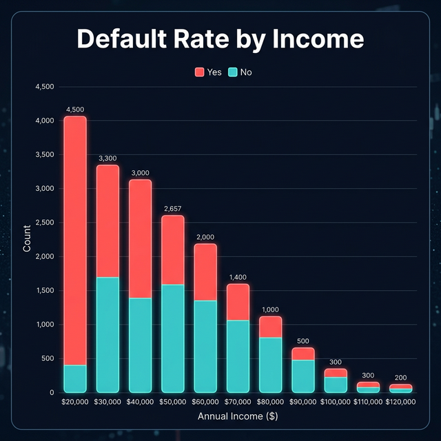
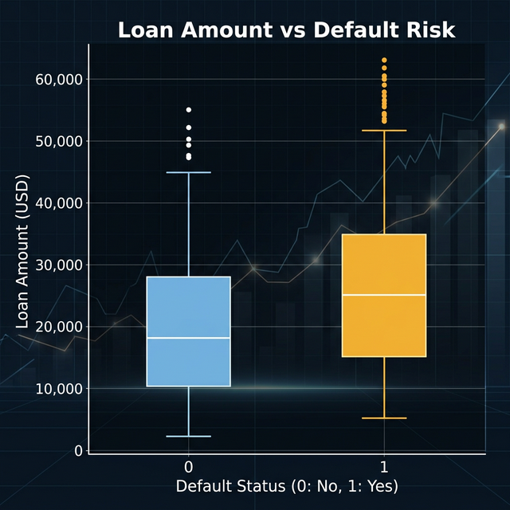
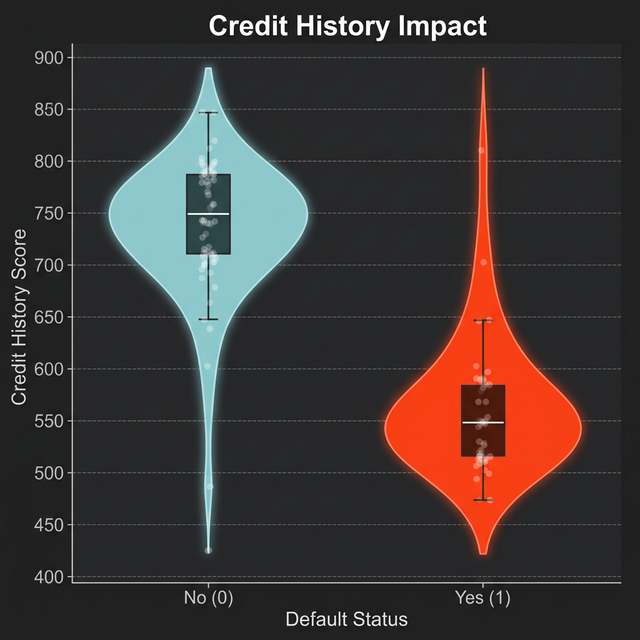
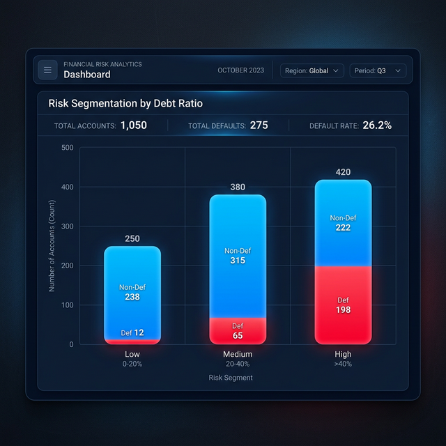

# Credit Risk Analysis for Loan Default Prediction


## 📌 Project Overview
This project, developed by **Zeynep Can** ([@zzeynepcan](https://github.com/zzeynepcan)), is a comprehensive data analysis and machine learning pipeline to evaluate loan default risk for banking customers. By analyzing financial and demographic indicators, the project aims to predict the likelihood of customers defaulting on their loans.

## 💼 Business Problem
Financial institutions face significant losses from loan defaults. Evaluating risk efficiently before issuing loans can minimize losses and optimize the portfolio. This project builds a realistic data-driven framework and predictive model to classify high-risk vs. low-risk customers based on their profiles, empowering banks to make informed lending decisions.

## 📂 Dataset Description
The dataset contains socio-economic and financial data of credit applicants. 
Key variables include:
- `income`: Annual income of the applicant.
- `loan_amount`: The amount requested for the loan.
- `credit_history`: A score representing the applicant's past credit behavior.
- `debt_ratio`: Total debt divided by total income.
- `employment_length`: Years of employment at the current job.
- `default_status`: Target variable (1 = Default, 0 = Non-Default).

## 🚀 Methodology

### 1. Data Understanding
Initial exploration of dataset features to understand the distribution, statistics, and correlation of different variables.

### 2. Data Cleaning
- Handling missing data using imputation techniques.
- Identifying and treating outliers that could distort the model.

### 3. Exploratory Data Analysis (EDA)
- Analyzing the relationship between target variable (`default_status`) and various features.
- Visualizing distributions (e.g., Default Rate by Income).

### 4. Feature Engineering
Creating meaningful financial metrics to improve model performance:
- **Debt-to-Income (DTI) Ratio**
- **Credit Utilization**

### 5. Model Building
Training robust classification algorithms:
- Logistic Regression
- Random Forest Classifier
- Gradient Boosting

### 6. Evaluation
Assessing model performance using critical metrics for imbalanced datasets:
- Accuracy, Precision, Recall, F1-Score
- ROC-AUC Score
- Confusion Matrix

## 📊 Key Insights & Visualizations
*(Below are some of the key findings from our analysis)*

### 1. Default Rate by Income

Lower income brackets show higher default rates, with a significant drop after the $70,000 threshold.

### 2. Loan Amount vs Default Risk

Higher loan amounts, especially when paired with a short credit history, significantly increase the probability of default.

### 3. Credit History Impact

Applicants with a credit history score below 600 represent the highest risk group, showing a clear correlation between past behavior and future default.

### 4. Risk Segmentation

Customers are segmented into 'High', 'Medium', and 'Low' risk tiers based on Debt-to-Income (DTI) and Credit History.

## 🛠️ Tools Used
- **Programming Language**: Python
- **Data Manipulation**: Pandas, NumPy
- **Machine Learning**: Scikit-Learn
- **Data Visualization**: Matplotlib, Seaborn

## ⚙️ How to Run the Project
1. Clone the repository:
   ```bash
   git clone https://github.com/zzeynepcan/credit-risk-analysis.git
   ```
2. Navigate to the directory:
   ```bash
   cd credit-risk-analysis
   ```
3. Install the dependencies:
   ```bash
   pip install -r requirements.txt
   ```
4. Run the scripts or explore the Jupyter Notebooks in the `notebooks/` directory.

## 📈 Conclusion
The machine learning pipeline established in this project effectively segments risky borrowers and provides actionable insights for financial organizations, significantly improving the safety and profitability of loan portfolios.
